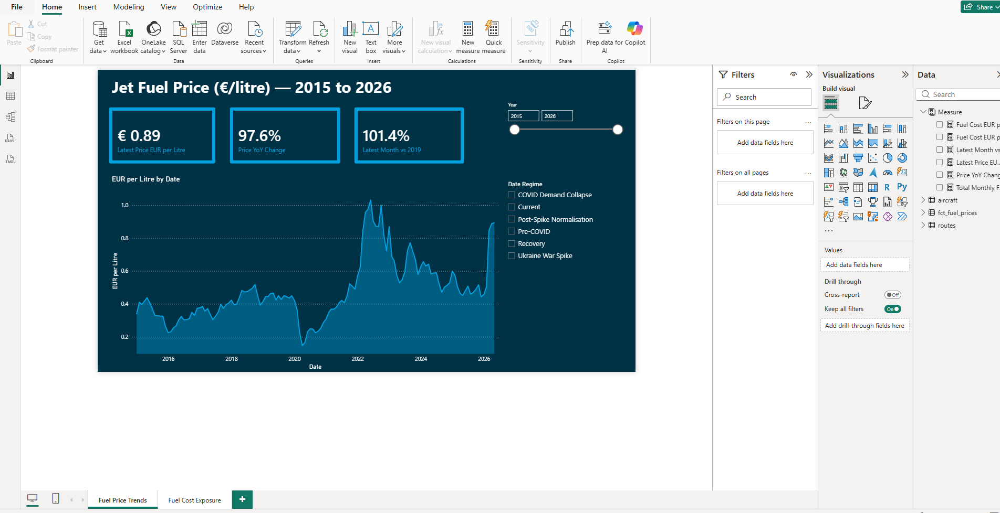
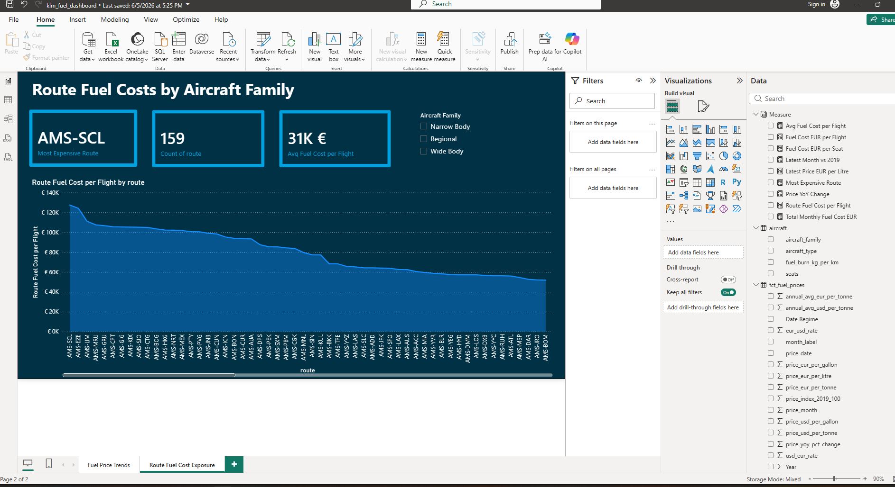
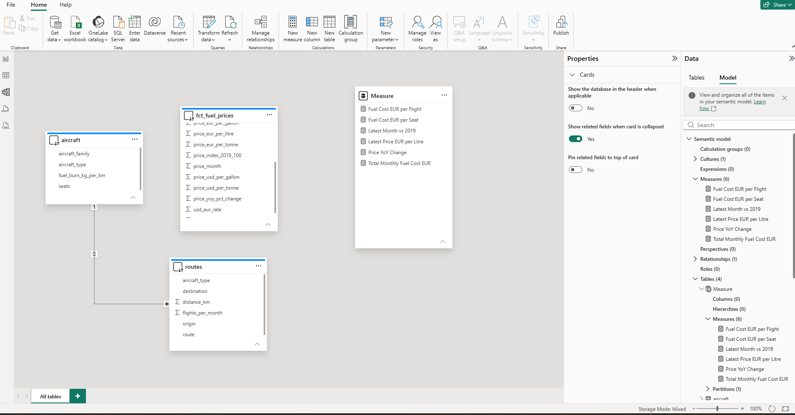

# KLM Fuel Cost & Route Exposure Dashboard

Hi, this is an end-to-end BI pipeline analysing how jet fuel prices have been changing throughout the years and how their movements impact KLM's route network.

The logic is straightforward, using REST APIs we pull historic jet fuel prices from the EIA and load them into BigQuery. Since prices are in USD we also pull EUR/USD exchange rates from the ECB to allow conversion into euros. 
Once the data is in BigQuery we use dbt to transform it through a staging and intermediate layer into final mart tables that serve as our fact tables in Power BI. From there we build the data model, write DAX measures, and visualise fuel price trends and route cost exposure across KLM's 159 routes and 7 aircraft types.

This project was built as a portfolio for a BI Specialist role at KLM Corporate Control and is still currently being updated and worked on.

Thanks for checking it out. Below is extensive developmental description of the project.

## Dashboard Preview

### Page 1 — Fuel Price Trends

### Page 2 — Route Fuel Cost Exposure

### Data Model

## Stack
- **Python** — REST API ingestion (EIA, ECB)
- **Google BigQuery** — data warehouse
- **dbt** — data transformation (staging → intermediate → marts)
- **Power BI** — dashboard via DirectQuery
- **GitHub** — version control

## Architecture

EIA API ──┐
          ├──► Python ──► BigQuery (raw) ──► dbt ──► Power BI
ECB API ──┘

## Data Sources

| Source | Data | URL |
|---|---|---|
| EIA | Monthly jet fuel spot price (USD/gallon) | https://www.eia.gov/opendata |
| ECB | Monthly EUR/USD exchange rate | https://data-api.ecb.europa.eu |
| KLM Annual Report | Fleet and route data | https://www.klmannualreport.com |

## dbt Models

staging/
├── stg_fuel_prices.sql      ← cleans EIA raw data
└── stg_fx_rates.sql         ← cleans ECB raw data

intermediate/
└── int_fuel_prices_eur.sql  ← joins prices with FX rates, calculates EUR prices

marts/
└── fct_fuel_prices.sql      ← final price fact table for Power BI

seeds/
├── routes.csv               ← KLM 159 routes with distance and aircraft type
└── aircraft.csv             ← aircraft fuel burn coefficients

## Key Metrics

| Metric | Description |
|---|---|
| price_eur_per_litre | Jet fuel price in EUR per litre |
| price_yoy_pct_change | Year over year price change in EUR |
| price_index_2019_100 | Price indexed to 2019 average = 100 |
| price_regime | Market period label (COVID, Ukraine spike etc.) |

## Setup

### Requirements
- Python 3.11
- Google Cloud account with BigQuery enabled
- EIA API key (free at eia.gov/opendata/register.php)

### Installation

1. Clone the repo:
git clone https://github.com/BukaRolly/klm-fuel-dashboard.git

2. Create virtual environment:
py -3.11 -m venv .venv311
source .venv311/Scripts/activate

3. Install dependencies:
pip install -r requirements.txt

4. Copy .env.example to .env and fill in your values:
EIA_API_KEY=your_key
GCP_PROJECT_ID=your_project
GCP_DATASET_ID=your_dataset
GOOGLE_APPLICATION_CREDENTIALS=/path/to/keyfile.json

5. Run ingestion:
python data_ingestion/load_extracts_to_bigquery.py

6. Run dbt:
cd klm_fuel_dbt
dbt seed --profiles-dir .
dbt run --profiles-dir .

## Notes
- Jet fuel prices sourced from EIA U.S. Gulf Coast Kerosene-Type Jet Fuel Spot Price (series EER_EPJK_PF4_RGC_DPG)
- KLM actual fuel costs are not public — route fuel costs are estimated using ICAO-derived fuel burn coefficients
- In a production environment, actual fuel uplift data would come from KLM's internal systems
- YoY change and price index are calculated in EUR to reflect KLM's reporting currency

### Windows Git Bash Note
If commands like ls or sed do not work, reinstall Git from https://git-scm.com/download/win and select Use Git and optional Unix tools from the Command Prompt during installation.